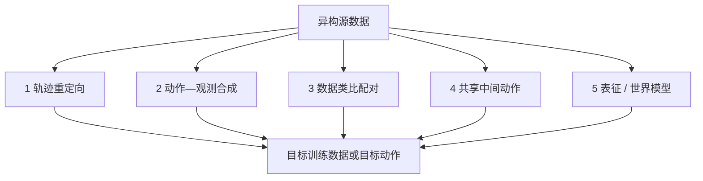
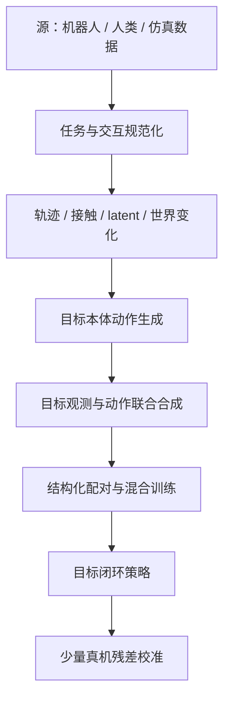

# 单源大规模数据向新构型机械臂迁移

## Manipulation Zero-shot / Few-shot 的五大技术路线系统调研

> **版本**：2026-07-31  
> **目标场景**：源机械臂已经积累大量 manipulation 数据；新构型目标机械臂数据很少或为零；希望复用源数据，使目标机械臂学会相同操作  
> **核心问题**：怎样把源机械臂的大规模 observation–action 数据转化为新构型可学习、可执行的训练信号，并把目标本体的重新示范成本降到最低？  
> **范围边界**：只讨论 manipulation；不围绕任何指定机器人型号展开；不讨论纯导航、纯 locomotion 或仅跨任务而不跨本体的泛化  
> **证据口径**：优先引用论文与项目主页；明确区分论文实验事实、本文归纳和仍待验证的判断

---

## 阅读导航

- [0. 执行摘要](#0-执行摘要)
- [1. 问题定义与口径](#1-问题定义与口径)
- [2. 五大技术路线总览](#2-五大技术路线总览)
- [3. 路线一：轨迹重定向与目标本体回放](#3-路线一轨迹重定向与目标本体回放)
- [4. 路线二：目标动作—目标观测联合合成](#4-路线二目标动作目标观测联合合成)
- [5. 路线三：跨本体数据类比与结构化配对](#5-路线三跨本体数据类比与结构化配对)
- [6. 路线四：共享中间动作](#6-路线四共享中间动作latent几何语言与接触意图)
- [7. 路线五：共享表征与跨本体世界模型](#7-路线五共享表征与跨本体世界模型)
- [8. 五条路线如何组合](#8-五条路线如何组合)
- [9. 代表工作横向对比](#9-代表工作横向对比)
- [10. 数据资产应如何设计](#10-面向跨本体复用的数据资产设计)
- [11. 评测协议](#11-严谨的评测协议)
- [12. 证据审计与研究缺口](#12-证据审计与研究缺口)
- [13. 研究路线建议](#13-研究路线建议)
- [14. 结论](#14-结论)

---

# 0. 执行摘要

## 0.1 场景锁定

本文只研究以下不对称设置：

\[
\underbrace{
\mathcal D_s=\{\tau_i^s\}_{i=1}^{N_s},
\quad N_s\ \text{很大}
}_{\text{已有源机械臂数据}}
\qquad\longrightarrow\qquad
\underbrace{
e_t,\ \mathcal D_t^{few},
\quad |\mathcal D_t^{few}|\ll N_s
}_{\text{新构型目标机械臂}}.
\]

目标是在同一组 manipulation 任务上学习目标策略：

\[
\pi_t(a_t^t\mid o_{1:t}^t,\ell),
\]

同时最小化：

\[
C_{\mathrm{target}}
=
C_{\mathrm{demo}}
+
C_{\mathrm{calibration}}
+
C_{\mathrm{adapter}}
+
C_{\mathrm{repair}}.
\]

这不是“训练一个可控制所有机器人的通用模型”这一更宽泛问题。多本体预训练、世界模型或人类视频只有在它们能帮助**现有单源数据迁移到当前新构型**时才纳入讨论。

### 目标机械臂的最小输入

目标端至少要提供下列信息中的一部分：

| 信息 | 能解决什么 | 是否属于目标任务示范 |
|---|---|---:|
| URDF/MJCF、mesh、关节限位 | FK/IK、碰撞、渲染、可达性 | 否 |
| TCP 与相机标定 | 源—目标坐标对齐 | 否 |
| 低层控制 API | 执行目标动作 | 否 |
| 无任务 random/play data | 学目标动作接口与动力学 | 否，但属于目标本体数据 |
| 少量同任务配对示范 | 校准视觉、策略与真实接触偏差 | 是 |

## 0.2 一句话结论

> 跨本体迁移的关键不是让不同机器人共享同一种原始动作，而是把源数据转换成**本体间可对齐的任务意图与物理交互接口**，再由目标本体生成自己的可执行动作。

源机器人数据一般包含：

\[
\tau^s
=
\left\{
I_t^s,\,
x_t^s,\,
a_t^s
\right\}_{t=1}^{T},
\]

其中图像 \(I_t^s\)、状态 \(x_t^s\) 和动作 \(a_t^s\) 都与源本体耦合。理想的迁移过程应为：

\[
\tau^s
\xrightarrow{F_s}
\underbrace{z_{1:T}}_{\text{可迁移任务/交互变量}}
\xrightarrow{G_t}
\underbrace{\hat{\tau}^{\,t}}_{\text{目标本体训练数据或动作}}.
\]

- \(F_s\)：从源轨迹提取物体中心运动、末端轨迹、接触意图、latent action、语言动作或预测世界变化；
- \(G_t\)：由目标本体的运动学、几何、控制器或少量目标数据，把 \(z\) 翻译成目标动作；
- \(\hat{\tau}^{\,t}\)：可直接训练目标策略的数据，或部署时直接执行的目标动作。

## 0.3 五大技术路线

| 路线 | 核心共享接口 | 源数据怎样产生价值 | 目标本体主要成本 | 更接近 |
|---|---|---|---|---|
| 1. 轨迹重定向与回放 | TCP、物体中心轨迹、关键事件 | 将源轨迹经 IK/优化转换为目标轨迹 | URDF、IK、仿真/控制器 | 模型辅助 zero-shot |
| 2. 动作—观测联合合成 | 目标本体一致的 observation–action 对 | 同时改写机器人外观、视角和动作标签 | 分割、渲染、标定、回放过滤 | 数据生成式 zero-shot |
| 3. 数据类比与结构化配对 | 同任务、同场景、相似轨迹的跨本体对应 | 用少量高信息密度目标轨迹建立“翻译字典” | 少量配对示范 | few-shot |
| 4. 共享中间动作 | latent、几何、语言动作、接触意图 | 在统一动作空间联合训练，再由目标 decoder 解码 | decoder、几何/运动学或少量目标数据 | zero/few-shot 均可 |
| 5. 共享表征与世界模型 | 行为表征、物体运动、未来世界状态 | 学习“动作将导致什么交互结果”，弱化关节绑定 | 大规模预训练、状态估计或少量 play data | 长期最通用 |

## 0.4 最重要的判断

1. **相似机械臂之间，轨迹重定向最成熟。**  
   当任务可由末端 SE(3) 轨迹和简单夹爪状态描述时，目标关节空间差异可由 IK、轨迹优化和安全控制器吸收。

2. **跨夹爪、跨灵巧手时，TCP 不再充分。**  
   一个平行夹爪开合量无法描述多指接触分配。必须引入功能点、几何形变、接触意图或共享 latent。

3. **视觉偏差与动作偏差是两件事。**  
   只重定向动作，会留下源机器人外观、遮挡和相机差异；只擦除机器人，又不会生成目标可执行动作。可靠系统通常同时处理两者。

4. **few-shot 的价值取决于“结构”，不只取决于条数。**  
   对形态变化而言，同任务、同布局、相似执行策略的 trajectory-paired 数据，通常比数量更大的无配对数据更有迁移价值。

5. **严格 zero-shot 仍不是“目标本体零成本”。**  
   许多论文不使用目标任务示范，但仍使用目标 URDF、FK/IK、mesh、相机标定、仿真模型、play data 或新本体 decoder。报告必须把这些成本显式列出。

6. **对当前“单源大数据 → 新构型”场景，最可信的是分层组合，而非单一路线通吃。**  
   轨迹/接触规范化解决“迁移什么”，目标观测合成解决“看起来像谁”，目标 decoder 解决“怎样执行”，少量 data analogies 解决真实世界残差。

## 0.5 技术成熟度判断

| 能力 | 当前判断 | 证据边界 |
|---|---|---|
| 异臂、相近末端、准静态操作 | 较成熟 | 多数结果依赖已知标定、可靠 IK 和相近任务能力 |
| 异臂、异夹爪 | 快速进展 | 几何/功能接口有效，但接触动力学仍难 |
| 平行夹爪到灵巧手 | 有明确方法但未普遍解决 | 多数任务范围较窄，仿真证据强于真机 |
| 单臂到双臂/组合式本体 | 早期 | 任务分解、同步接触与能力不对称尚缺统一接口 |
| 未见本体开箱式 zero-shot | 少量强结果，尚非通用能力 | 常有目标模型、decoder、mask 或少量 play data |
| 柔性物体与高精度接触 | 最困难 | 仅运动学或视觉接口不足，需要力/触觉/动力学 |

---

# 1. 问题定义与口径

## 1.1 本报告的单源—单目标任务

设源机械臂为 \(e_s\)，新构型目标机械臂为 \(e_t\)。源端已有大规模数据：

\[
\mathcal D_s
=
\left\{
\tau_i^s
\right\}_{i=1}^{N_s},
\qquad
\tau_i^s
=
\left\{
o_k^s,x_k^s,a_k^s
\right\}_{k=1}^{T_i}.
\]

目标不是把 \(a_k^s\) 原样复制给目标机械臂，因为：

\[
a_k^s\in\mathcal A_s,\qquad
a_k^t\in\mathcal A_t,\qquad
\mathcal A_s\neq\mathcal A_t.
\]

需要学习或构造数据迁移器：

\[
\mathcal T_{s\rightarrow t}:
\mathcal D_s
\longrightarrow
\hat{\mathcal D}_t
=
\left\{
\hat o_k^t,\hat x_k^t,\hat a_k^t
\right\},
\]

再用：

\[
\mathcal D_{\mathrm{train}}
=
\mathcal D_s^{can}
\cup
\hat{\mathcal D}_t
\cup
\mathcal D_t^{few}
\]

训练目标策略。这里 \(\mathcal D_t^{few}\) 可以为空，也可以是极少量目标真机锚点。

一项方法要真正适合本报告场景，必须满足：

- 训练数据来自不同于目标本体的机器人或人类；
- 目标本体在机械臂、末端执行器、自由度、视角或控制接口上存在结构差异；
- 源数据能提高目标本体在相同或相关操作任务上的表现；
- 对照实验能够排除“只是增加了目标本体数据”这一解释。
- 能说明如何利用**大量源数据**，而不是只展示两台机器人各自采集完整数据后的联合训练。

以下情形不应混为一谈：

| 情形 | 是否属于本文核心问题 | 原因 |
|---|---|---|
| 同一机器人跨新物体/新任务 | 否 | 是任务或视觉泛化，不是本体迁移 |
| 同型号机器人更换场景 | 否 | 主要是场景域迁移 |
| 不同机械臂、相同任务 | 是 | 存在运动学与视觉本体差异 |
| 相同机械臂、更换夹爪/灵巧手 | 是 | 末端动作空间和接触结构变化 |
| 人类手视频迁移到机器人手 | 仅作辅助证据 | 本报告的主资产仍是源机械臂数据 |
| 单臂策略迁移到双臂 | 是，但更困难 | 目标本体能力和动作维度均发生变化 |

## 1.2 跨本体真正迁移的是什么

原始 joint action 通常不可直接共享。可迁移信息由“低抽象、强可执行”到“高抽象、强通用”依次为：

| 层级 | 可迁移变量 | 优点 | 缺点 |
|---|---|---|---|
| 关节层 | \(q,\dot q,\tau\) | 直接执行 | 几乎完全绑定本体 |
| 末端层 | TCP 位姿/增量、夹爪事件 | 易由 IK 转换 | 难表示复杂多指接触 |
| 物体交互层 | 物体轨迹、关键点、功能点、接触图 | 跨形态能力强 | 需要感知、配准和约束求解 |
| 行为 latent 层 | motif、latent action、语言动作 | 可联合学习异构数据 | 对齐质量难解释 |
| 世界变化层 | 未来视觉/几何/物理状态 | 最接近共享任务结果 | 模型、算力和闭环控制成本高 |

## 1.3 需要跨越的五种差异

| 差异轴 | 具体表现 | 主要解决路线 |
|---|---|---|
| 视觉本体差异 | 机器人外观、自遮挡、腕部视野、相机位姿 | 路线 2、5 |
| 机械臂运动学 | DoF、连杆长度、关节限位、奇异位姿、工作空间 | 路线 1、4 |
| 末端接触结构 | 指数、拓扑、接触面、开合方式 | 路线 2、4、5 |
| 控制与时序接口 | 关节/TCP 控制、频率、延迟、action chunk | 路线 1、4 |
| 动力学与物理交互 | 摩擦、柔顺性、力矩、回差、滑移 | 路线 4、5；通常需目标校准 |

## 1.4 Zero-shot / Few-shot 必须分级

“没有目标任务示范”不等于“没有目标本体信息”。建议统一使用下表：

| 级别 | 目标任务示范 | 可用目标信息 | 建议称谓 |
|---|---:|---|---|
| Z0 | 0 | 标准传感与控制 API，不训练目标模块 | 开箱式 zero-shot |
| Z1 | 0 | URDF/MJCF、mesh、FK/IK、相机标定、目标控制器 | 模型辅助 zero-shot |
| Z2 | 0 | 可用无任务 play/random data 或运动学数据训练 adapter | 本体适配后任务 zero-shot |
| F-\(K\) | \(K>0\) | 目标模型 + \(K\) 条目标任务示范 | \(K\)-shot transfer |
| FT | 较多 | 目标任务数据足以常规微调 | 跨本体预训练后微调 |

报告论文结果时，至少同时写清：

1. 目标本体是否出现在预训练中；
2. 是否使用目标任务示范；
3. 是否使用目标无任务数据；
4. 是否训练新 decoder/adapter；
5. 是否需要目标仿真、URDF、mesh 或相机标定；
6. 是否在真机验证；
7. 是否改变低层控制器。

## 1.5 统一数学框架

跨本体迁移可以写成三层：

\[
\underbrace{
z_t = F_\theta(o_{1:t}^s, a_{1:t-1}^s, \ell)
}_{\text{任务/交互表示}}
\]

\[
\underbrace{
\hat a_{t:t+H-1}^e
=
G_{\phi_e}(z_t, x_t^e, m_e)
}_{\text{本体条件动作生成}}
\]

\[
\underbrace{
o_{t+1}^e
\sim
P_e(o_{t+1}\mid o_t^e,\hat a_t^e)
}_{\text{目标本体物理执行}}.
\]

- \(m_e\)：URDF、mesh、关节限制、相机参数等本体描述；
- \(F_\theta\)：共享策略、行为表示或世界模型；
- \(G_{\phi_e}\)：IK、优化器、decoder、adapter 或低层控制策略；
- \(P_e\)：目标本体真实动力学。

五条技术路线的区别，本质上是选择了不同的 \(z_t\)、不同的 \(G_{\phi_e}\)，以及不同方式处理 \(P_e\) 的偏差。

---

# 2. 五大技术路线总览

## 2.1 技术谱系

五条路线不是互斥算法，而是位于数据处理、动作接口和模型学习三个层面的不同机制：

- 路线 1–2：主要回答“怎样把源数据改造成目标数据”；
- 路线 3：主要回答“哪些源/目标数据放在一起最有用”；
- 路线 4：主要回答“不同本体怎样共享动作语义”；
- 路线 5：主要回答“怎样共享行为和物理规律，而非共享动作本身”。

## 2.2 快速选择表

| 场景 | 第一选择 | 必要增强 | 不应高估 |
|---|---|---|---|
| 异臂、相近平行夹爪 | 路线 1 | 路线 2 + 少量路线 3 | 单纯 joint action co-training |
| 相同臂、更换夹爪 | 路线 4 的几何/功能接口 | 路线 2 的目标观测合成 | 只用 TCP + 开合标量 |
| 平行夹爪到灵巧手 | 路线 4 的接触/几何 latent | 路线 3 的目标锚点 + 路线 5 | 纯运动学即可解决力学差异 |
| 人类视频到机器人 | 路线 5 或对象中心表示 | 路线 4 的目标 decoder | 把人手像素动作当机器人动作 |
| 未见本体零任务示范 | 路线 4/5 | 目标模型、控制器、mask 或无任务数据 | 把 Z1/Z2 宣称为 Z0 |
| 接触丰富/柔性物体 | 路线 5 的物理模型 | 触觉/力 + 少量真机校准 | 只在仿真报告 IK 成功率 |

## 2.3 五条路线在“单源大数据 → 新构型”中的具体作用

| 路线 | 对已有大量源数据做什么 | 为新构型生成什么 | 目标端还要做什么 |
|---|---|---|---|
| 1. 轨迹重定向 | 批量提取 TCP/物体中心轨迹 | 目标关节轨迹与 action label | FK/IK、碰撞检查、回放过滤 |
| 2. 动作—观测合成 | 保留真实场景与任务过程，替换源机器人 | 目标视觉 + 目标状态 + 目标动作三者对齐的数据 | 目标 mesh、相机标定、渲染 |
| 3. 数据类比 | 从海量源数据中检索最像目标 few-shot 的子集 | 高信息密度 source–target pairs | 采极少量结构化目标锚点 |
| 4. 共享中间动作 | 将所有源动作编码为统一 intent/latent | 由新构型 decoder 生成目标动作 | 用几何、运动学或少量数据学习 decoder |
| 5. 表征/世界模型 | 从源数据学习任务阶段、对象运动和交互结果 | 目标本体条件下的未来状态或计划 | play data、inverse model 或 MPC |

这张表也是全文的判断标准：如果一种方法不能说明“源端海量数据经过什么变换后，给目标端提供了什么监督”，它就不是本场景的主路线。

## 2.4 成本—通用性坐标

| 路线 | 实现成本 | 对本体模型依赖 | 对目标示范依赖 | 跨形态上限 |
|---|---:|---:|---:|---:|
| 1. 轨迹重定向 | 中 | 高 | 低 | 中 |
| 2. 动作—观测合成 | 高 | 高 | 低 | 中—高 |
| 3. 数据类比 | 低—中 | 低 | 中 | 中—高 |
| 4. 共享中间动作 | 中—高 | 中—高 | 低—中 | 高 |
| 5. 表征/世界模型 | 很高 | 视方法而定 | 低—中 | 最高，但尚未成熟 |

---

# 3. 路线一：轨迹重定向与目标本体回放

## 3.1 核心思想

先把源关节轨迹转换为本体相对无关的任务空间轨迹，再用目标本体重新求解：

\[
q_{1:T}^{s}
\xrightarrow{\mathrm{FK}_s}
{}^{W}T_{E,1:T}^{s}
\xrightarrow{\text{object-centric}}
{}^{O}T_{E,1:T}
\xrightarrow{\mathrm{IK}_t/\mathrm{TO}_t}
\hat q_{1:T}^{t}.
\]

其中：

- \({}^{W}T_E\)：世界坐标下末端位姿；
- \({}^{O}T_E\)：任务相关物体坐标下末端位姿；
- \(\mathrm{TO}\)：trajectory optimization。

目标动作可通过约束优化生成：

\[
\hat q_{k+1}^{t}
=
\arg\min_q
\left\|
\mathrm{FK}_t(q)-T_{E,k+1}^{*}
\right\|_{W}^{2}
+
\lambda_v\|q-q_k\|_2^2
+
\lambda_a\|q-2q_k+q_{k-1}\|_2^2
\]

并满足：

\[
q_{\min}\le q\le q_{\max},\qquad
\dot q\le \dot q_{\max},\qquad
d_{\text{collision}}(q)\ge d_{\min}.
\]

## 3.2 标准数据流

## 3.3 代表工作

### MimicGen

[MimicGen](https://arxiv.org/abs/2310.17596) 将少量人工示范切分为物体中心子轨迹，通过改变场景初态、变换并回放子轨迹，自动合成训练示范。论文报告从约 200 条人工示范生成 18 个任务、超过 5 万条示范，并包含不同机械臂的实验。

**它提供的核心证据**不是“任何本体都能直接 zero-shot”，而是：

- 物体中心子轨迹是可重用的数据单元；
- 目标回放与成功过滤可以把源示范变成新本体数据；
- 数据生成能显著降低重复遥操作成本。

### EmbodiSteer

[EmbodiSteer](https://arxiv.org/abs/2606.12965) 保持策略在笛卡尔空间预测，在扩散采样过程中利用目标机器人 FK/Jacobian 将轨迹提升到关节空间，并加入全身碰撞引导。论文报告在 9 种仿真本体上降低 46.1% 碰撞率、提高 28.5% 成功率；两种真机上分别降低 90.0% 碰撞率、提高 36.7% 成功率。

其意义在于：统一 TCP 接口虽可迁移，但**若不显式注入目标身体约束，笛卡尔策略仍可能穿过目标机器人自己的身体或障碍物**。

### SoftMimicGen

[SoftMimicGen](https://arxiv.org/abs/2603.25725) 将轨迹生成扩展到柔性物体，使用非刚性配准变形源末端轨迹。它说明“物体中心轨迹”在柔性场景中需要升级为形变感知轨迹；但跨本体执行仍需要目标模型和控制接口。

## 3.4 适用条件

- 源和目标具备相近的任务能力；
- 任务主要由末端运动与少数离散接触事件决定；
- 目标本体有可靠 FK/IK、碰撞模型和低层控制器；
- 接触过程近似准静态；
- 目标工作空间覆盖源任务空间。

## 3.5 优势

- 输入输出清晰，工程可解释；
- 可直接生成 BC、Diffusion Policy 或 Flow Policy 的目标动作标签；
- 不要求训练复杂跨本体 latent；
- 可显式检查可达性、碰撞和轨迹平滑性；
- 很适合构造合成目标数据和可控消融实验。

## 3.6 关键失败模式

| 失败 | 根因 | 必要修复 |
|---|---|---|
| IK 有解但任务失败 | 几何可达不等于接触可行 | 仿真/真机回放和成功过滤 |
| 关节跳变 | 冗余解在相邻帧切换 | 连续初始化、速度/加速度/jerk 正则 |
| 目标碰撞 | TCP 路径忽略整机几何 | 碰撞约束、joint-space steering |
| 跨夹爪失败 | 夹爪事件无法描述多指接触 | 路线 4 的功能/接触表示 |
| 插入或旋拧失败 | 力与柔顺性不在 SE(3) 轨迹中 | 触觉/力反馈、residual 或世界模型 |

## 3.7 Zero-shot 口径

该路线通常属于 **Z1**：

- 目标任务示范可为 0；
- 但必须知道目标本体模型、IK、控制器和场景关系；
- 若训练了目标 residual 或使用目标回放数据，则应额外说明属于 Z2 或 few-shot。

---

# 4. 路线二：目标动作—目标观测联合合成

## 4.1 为什么只转换动作不够

源数据中的视觉观测常包含源机器人：

\[
I_t^s = \mathrm{Scene}_t + \mathrm{Robot}_s + \mathrm{Occlusion}_s.
\]

部署到目标本体时：

\[
I_t^t = \mathrm{Scene}_t + \mathrm{Robot}_t + \mathrm{Occlusion}_t.
\]

即使动作标签已经重定向，如果训练图像仍显示源本体，策略可能把源机器人的外观、遮挡边界或腕部视野当成控制线索。路线二因此同时生成：

\[
\left(I_t^s,a_t^s\right)
\longrightarrow
\left(\hat I_t^t,\hat a_t^t\right).
\]

## 4.2 三种实现范式

| 范式 | 处理方式 | 代表工作 | 局限 |
|---|---|---|---|
| 训练时机器人替换 | 分割源机器人、背景修复、渲染目标机器人 | RoVi-Aug、OXE-AugE、CEI | 合成质量与标定依赖高 |
| 部署时 cross-painting | 屏蔽目标机器人并绘制源机器人 | Mirage | 需要实时视觉处理 |
| 训练时本体消隐 | mask 掉腕部视图中的末端执行器 | Cloak | 舍弃了一部分可能有用的接触视觉 |

## 4.3 代表工作

### RoVi-Aug

[RoVi-Aug](https://arxiv.org/abs/2409.03403) 使用生成式图像编辑合成不同机器人和相机视角的示范。真机实验表明，机器人与视角增广支持未见机器人上的 zero-shot 部署，并可使成功率最高提高约 30%。

它揭示了两个独立因素：

- **robot appearance**：机器人长相和自遮挡；
- **viewpoint**：相机姿态与视野。

这两者不应都被笼统称为“跨本体”后一起平均。

### OXE-AugE

[OXE-AugE](https://arxiv.org/abs/2512.13100) 的 AugE-Toolkit 将 OXE 数据增广到 9 种机器人本体，构成超过 440 万条轨迹。流程包括源机器人分割与修复、目标本体轨迹回放、目标机器人渲染以及目标动作标签生成。论文报告 OpenVLA 和 \(\pi_0\) 在未见机器人—夹爪组合的四个真机任务上提升 24–45%。

**证据边界**：

- 强结果证明大规模本体增广有价值；
- 但增广仍依赖目标模型、渲染、标定和可回放轨迹；
- 视觉合成不能自动补齐真实摩擦、力控、负载和时延差异。

### CEI

[CEI](https://arxiv.org/abs/2601.09163) 定义带方向的末端功能点，以 Directional Chamfer Distance 衡量不同夹爪/手的功能相似性，再通过梯度优化对齐轨迹并合成目标点云观测和动作。

论文报告：

- 从一种源本体迁移到 16 种本体、3 个仿真任务；
- 两种真机臂—手组合之间在 6 个任务上双向迁移；
- 平均 transfer ratio 为 82.4%。

CEI 位于路线 2 与路线 4 的交界：它既合成目标 observation–action，也使用功能几何作为共享接口。

### Mirage

[Mirage](https://arxiv.org/abs/2402.19249) 不重新训练策略，而是在执行时遮掉目标机器人并绘制源机器人，同时进行状态对齐。论文聚焦工作空间相近、二指夹爪为主的常见机械臂，并在仿真和真机的抓取、堆叠、装配等任务中展示 zero-shot 迁移。

Mirage 的结论应限定为：

- 它证明了视觉本体外观是一个可被显式修复的迁移障碍；
- 不代表大幅不同的末端能力或接触机制也能被“绘制”解决。

### Cloak

[Cloak](https://arxiv.org/abs/2606.22836) 在训练时用已知几何实时渲染 mask，遮掉腕部相机中的末端执行器，并对 mask 做增广。其 Cloak-VLA 只使用一种平行夹爪数据训练，却 zero-shot 迁移到未见夹爪、未见机械臂和五指手。

该思路很干净：不要求把目标外观合成为某个源机器人，而是训练策略**不要依赖本体外观**。但对需要精确观察手指—物体接触的任务，遮掉末端可能损失关键状态。

### Masquerade

[Masquerade](https://arxiv.org/abs/2508.09976) 把野外第一视角人类视频“机器人化”：先恢复 3D 手部轨迹，移除人臂，再叠加跟随该轨迹的双臂机器人。作者用 67.5 万帧编辑视频预训练未来 2D 机器人关键点预测器，并在每个任务 50 条目标机器人示范上继续联合训练 Diffusion Policy；三项双臂长时序厨房任务相对基线提高约 5–6 倍。

它证明视觉本体编辑可让大量无动作标签的人类视频进入策略训练，但不应写成纯 zero-shot 联合合成：编辑视频主要提供视觉与关键点监督，目标低层动作仍来自少量真机示范。因此它位于路线 2 与路线 3 的交界。

### UMIGen

[UMIGen](https://arxiv.org/abs/2511.09302) 使用 Cloud-UMI 同步采集第一视角点云—动作对，并将 DemoGen 扩展为可见性感知的 3D 数据生成：只保留目标相机视锥内可见的点，同时生成与变换后轨迹一致的 observation–action pair。相较只编辑 RGB，它更直接地约束了几何、第一视角和动作标签的一致性，并在仿真与真机中验证跨本体使用。

其边界是依赖专用采集器、点云质量、几何变换和目标控制器；“可直接跨本体”不能外推为任意构型、任意接触任务都无需可达性与回放检查。

### Disentangled Cross-Embodiment Video Editing

[Disentangled Cross-Embodiment Video Editing](https://arxiv.org/abs/2605.03637) 将源视频分解为任务表示与本体表示，再把单条人类视频的任务表示和目标机器人图像组合，通过冻结视频扩散骨干与轻量 adapter 生成目标本体执行视频。训练不要求成对人—机器人视频；下游 Unitree H1 抓取实验中，ACT 的总验证损失从 0.2006 降到 0.1886。

这项工作的主要证据仍是视频生成指标和动作预测误差，而不是充分的真机成功率。生成视频本身也不自动携带可执行低层动作标签，所以它更准确地说是路线 2 的“目标观测合成模块”，尚不是完整 observation–action 转换流水线。

### TrajSkill

[TrajSkill](https://arxiv.org/abs/2510.07773) 将人类运动表示为稀疏光流轨迹，以此作为本体无关运动条件，同时生成时序一致的机器人执行视频并翻译为可执行动作。论文在 MetaWorld 中报告 FVD 降低 39.6%、KVD 降低 36.6%，跨本体成功率最高提高 16.7%，并给出真机厨房操作验证。

它把路线 2 的目标视觉生成与路线 4 的中间运动接口连接起来，但系统同时依赖光流轨迹、视频生成器和动作翻译器，任何一层的时序或几何误差都会向下游级联。

## 4.4 必须共同生成的标签

一个严谨的目标合成样本至少应满足：

\[
\hat{\mathcal{D}}_t
=
\{
\hat I_t^t,\,
\hat x_t^t,\,
\hat a_t^t,\,
m_t^{\mathrm{robot}},\,
c_t,\,
y_t^{\mathrm{valid}}
\},
\]

其中：

- \(\hat I_t^t\)：目标本体视觉；
- \(\hat x_t^t\)：目标本体状态；
- \(\hat a_t^t\)：目标动作；
- \(m_t^{\mathrm{robot}}\)：机器人 mask；
- \(c_t\)：接触/关键事件标签；
- \(y_t^{\mathrm{valid}}\)：回放可行性或任务成功标签。

只生成“看起来合理”的图像、却没有与图像严格对齐的目标动作，不能视为有效 imitation learning 数据。

## 4.5 质量控制

目标合成数据应通过四层过滤：

1. **几何一致性**：相机、目标机器人、物体和桌面的 3D 对齐；
2. **运动学一致性**：目标状态与目标动作能产生渲染中的姿态；
3. **时序一致性**：视觉帧、状态、动作与控制频率严格同步；
4. **任务一致性**：回放完成正确接触与目标状态，而非仅轨迹可达。

## 4.6 Zero-shot 口径

- 训练不使用目标任务真机示范，可归为 **Z1**；
- 若目标本体合成数据参与训练，不能称作“目标本体完全未见”；
- 若部署时做 cross-painting，则应报告实时延迟、mask 误差和失败恢复成本。

---

# 5. 路线三：跨本体数据类比与结构化配对

## 5.1 核心思想

路线三不改变模型结构，而是改变数据集中的“连接关系”。其问题不是：

> 源数据够不够多？

而是：

> 源数据是否告诉模型，同一个任务意图在不同身体上分别对应什么观测与动作？

## 5.2 三种对应强度

[Data Analogies](https://arxiv.org/abs/2603.06450) 将跨机器人数据分为：

| 类型 | 约束 | 迁移信息密度 |
|---|---|---:|
| Unpaired | 只有任务大类或数据域相关 | 低 |
| Task-paired | 相同对象、初始条件和目标 | 中 |
| Trajectory-paired | 任务相同且执行策略/轨迹相似 | 高 |

轨迹可用任务空间特征对齐：

\[
\phi_t
=
\left[
x_t^{ee},\,
R_t^{ee},\,
g_t,\,
\kappa_t
\right],
\]

其中 \(\kappa_t\) 是物体中心的任务进度量。通过 Dynamic Time Warping：

\[
d(\tau_i^s,\tau_j^t)
=
\mathrm{DTW}
\left(
\phi_{1:T_i}^{s},
\phi_{1:T_j}^{t}
\right)
\]

筛选跨本体对应轨迹。

## 5.3 关键实证结论

Data Analogies 的实验将域差异拆成：

- 相机视角；
- 本体形态；
- 机器人外观。

论文发现：

- 视角和外观偏差更受益于广泛覆盖和视觉多样性；
- 形态偏差更依赖 task-paired / trajectory-paired 对应；
- 大量无配对数据不能完全替代少量高质量跨本体对应；
- 在只改变数据组成、不改变模型结构和训练过程的条件下，真实机器人跨本体迁移相对大规模无配对数据平均提高 22.5%。

这项结果非常重要，因为它说明**数据连通性与数据规模是两个不同的尺度变量**。

**证据边界**：该论文主实验并非“5-shot”；若干主要条件固定使用 50 条目标示范，并比较同预算下不同源数据组成。因此本文把它视为“结构化目标锚点优于无配对扩量”的证据，而不直接把 22.5% 外推到任意 5-shot 设置。

## 5.4 补充代表工作

### MIR：用同一底层轨迹生成强配对视觉

[Manipulator-Independent Representations（MIR）](https://www.roboticsproceedings.org/rss17/p002.html) 是路线三的早期代表。它把同一条仿真物体操作轨迹渲染为 arm-randomized、domain-randomized 和 invisible-arm 等不同视觉域，形成 10,792 对训练轨迹，并学习对本体外观不敏感、但对物体状态变化敏感的表示。随后，机器人通过 RL 在该表示空间跟踪未见人手、夹具和真机视频示范。

这说明强配对不一定只能由两台真机重复遥操作获得，也可以由共享仿真状态跨域渲染产生。但它的目标是单轨迹视觉跟踪，不是现代 VLA 的 few-shot 联合微调；仿真配对也无法替代真实接触和动力学校准。

### EgoBridge：没有逐轨迹配对时做分布级对齐

[EgoBridge](https://arxiv.org/abs/2509.19626) 联合训练第一视角人类数据和机器人数据，并以 Optimal Transport 衡量“策略 latent＋动作”的联合分布差异。它不要求人工构造一一对应轨迹，而是学习分布级弱对应，同时约束表征保留动作相关信息。三项单双臂真机任务中，论文报告相对 human-augmented cross-embodiment 基线绝对提升 44 个百分点。

它属于路线三与共享表征路线的交叉：优点是降低严格 pairing 的采集负担，代价是仍需目标机器人训练数据，而且 OT 对齐不保证具体任务阶段存在可解释的一一对应。

### HRDexDB：把结构化配对扩展到多指抓取

[HRDexDB](https://arxiv.org/abs/2604.14944) 在相同 100 个物体上采集人手和 4 种灵巧手的 2.1K 条近配对抓取序列，提供 21 个外部视角、2 个第一视角、统一坐标系中的 3D 手/机器人轨迹、物体 6D 位姿、触觉和成功标签。基于配对数据学习的 grasp retrieval 可为 BODex 提供跨本体初始化，并优于直接人手到机器人运动学重定向。

其意义更多是为路线三提供真实高自由度配对数据和 benchmark，而非一个完整策略算法；当前任务集中于抓取，且“相同物体、相似抓法”仍不等于严格逐帧对应。

## 5.5 配对数据怎样进入训练

### 配对 batch sampling

每个 batch 同时采样一组源/目标 analogies：

\[
\mathcal{B}
=
\left\{
(\tau_i^s,\tau_{\pi(i)}^t)
\right\}_{i=1}^{B}.
\]

### 表征对齐

\[
\mathcal{L}_{\mathrm{align}}
=
\left\|
h_\theta(\tau_i^s)
-
h_\theta(\tau_{\pi(i)}^t)
\right\|_2^2.
\]

### 行为保持

只对任务阶段或物体效果一致的样本拉近，避免把不同可行策略强行压成一个模式：

\[
\mathcal{L}
=
\mathcal{L}_{\mathrm{BC}}
+
\lambda
\mathbb{1}
[y_i^s \simeq y_j^t]
\mathcal{L}_{\mathrm{align}}.
\]

## 5.6 Few-shot 采集原则

如果目标本体只能采少量示范，优先保证：

- 相同对象、摆放和目标状态；
- 相同或可比的接近方向；
- 相同操作策略，而不只是相同任务标签；
- 明确标注 approach、first contact、stable grasp、release 等事件；
- 同步记录物体状态或可靠的对象关键点；
- 覆盖目标本体最容易偏离源策略的形态边界。

“随机采 5 条”与“设计 5 条跨本体锚点”不应被视为相同 few-shot 设置。

## 5.7 优势与限制

**优势**

- 不必大幅更改现有 VLA / Diffusion Policy；
- 目标数据很少时仍能提供高信息密度监督；
- 可与其他四条路线叠加；
- 可直接比较“数据量”与“数据结构”的贡献。

**限制**

- trajectory pairing 本身需要任务事件、物体轨迹或末端轨迹；
- 不同本体可能采用本质不同的最优策略，一一配对会产生错误约束；
- 它是 few-shot 的高效组织方法，不是严格零目标数据方案；
- 对目标本体完全没有可行执行策略的能力缺口，配对无法凭空创造能力。

---

# 6. 路线四：共享中间动作——Latent、几何、语言与接触意图

## 6.1 核心思想

为每种本体直接预测不同维度的动作：

\[
a_t^e \in \mathbb{R}^{d_e}
\]

会使共享策略长期绑定于本体 action head。路线四改为：

\[
o_t,\ell
\rightarrow
z_t
\rightarrow
D_e(z_t,m_e)
\rightarrow
a_t^e,
\]

其中 \(z_t\) 是跨本体共享的中间动作，\(D_e\) 是目标本体 decoder。

中间动作可分四类：

| 类型 | \(z_t\) 表示什么 | 代表工作 |
|---|---|---|
| 学习式 latent | 经对比学习或 VQ 得到的动作语义 | Latent Action Diffusion、MOTIF |
| 几何 action | 功能点、粒子位移、球面形变 | CEI、OPFA、UHAS |
| 接触 intent | 在哪里接触、怎样运动、交互方向 | KITE |
| 语言动作 | 用自然语言表达低层运动 | LAP |

## 6.2 Latent Action Diffusion

[Latent Action Diffusion](https://arxiv.org/abs/2506.14608) 用对比学习将人手、灵巧手和平行夹爪动作编码到共享 latent：

\[
z_t=E_e(a_t^e),\qquad
\hat a_t^e=D_e(z_t).
\]

随后在 \(z\) 空间训练 diffusion policy。论文报告多本体 co-training 相比单本体策略，操作成功率最高提高 25.3%。

**严谨理解**：

- 这是“共享 latent 支持异构数据联合训练”的证据；
- 新本体仍需 retargeting 对应或 encoder/decoder；
- co-training 收益不自动等于未见本体 zero-shot。

## 6.3 MOTIF

[MOTIF](https://arxiv.org/abs/2602.13764) 将异构动作中的本体无关时空模式离散为 action motifs：

\[
z_t=\mathrm{VQ}(a_{t:t+H}^e,x_t^e).
\]

其通过 progress-aware alignment 和 embodiment-adversarial 约束学习统一 motif，再用 motif 引导 flow-matching policy，并融合机器人特定状态生成目标动作。论文报告 few-shot 设置下相对强基线在仿真提高 6.5 个百分点、真机提高 43.7 个百分点。

**口径限制**：目标本体在训练体系中的可见程度、其他任务数据与目标任务示范必须分开报告；“新任务 few-shot”不等于“完全未见本体 few-shot”。

## 6.4 OPFA

[One-Policy-Fits-All（OPFA）](https://arxiv.org/abs/2603.14522) 使用末端几何学习 Geometry-Aware Latent Representation，并通过统一 latent retargeting decoder 输出不同 DoF 的动作。

论文覆盖 11 种末端执行器，并报告：

- 跨本体联合训练相对 single-source 可提升超过 50%；
- 新本体只加入 8 条示范，可达到接近 72 条示范充分训练的表现。

OPFA 的价值是把“每个本体单独 decoder”推进到由几何条件化的统一 decoder；但其证据主要覆盖末端几何差异，不能直接外推到所有动力学、双臂协同或移动操作。

## 6.5 KITE

[KITE](https://arxiv.org/abs/2606.22113) 将策略拆为：

\[
\text{共享任务策略}
\rightarrow
\text{interaction intent}
\rightarrow
\text{目标动作 decoder}.
\]

共享策略从源示范学习接触模式；目标 decoder 只用目标本体的运动学模型训练，无需目标任务示范。其评测覆盖平行夹爪、灵巧手和组合式本体之间的迁移。

这是较接近 **Z2** 的路线：

- 目标任务示范为 0；
- 但需要训练目标 decoder；
- decoder 使用目标运动学模型，而不是完全无目标信息；
- 当任务无法由接触模式充分表达，或真实接触动力学偏离模型时，性能会受限。

## 6.6 LAP

[LAP](https://arxiv.org/abs/2602.10556) 直接把低层动作写成自然语言，使动作监督落在 VLM 已熟悉的语言空间。LAP-3B 报告在多个未见机器人与 manipulation 任务上达到超过 50% 的平均 zero-shot 成功率，约为此前强 VLA 的 2 倍。

它提供了一个不同方向：

- 不为每种动作拓扑设计私有 tokenizer；
- 用语言作为可跨本体共享的动作接口；
- 由部署端把语言动作转换为机器人可执行控制。

需要注意：

- 语言的离散性和歧义可能损失精细控制信息；
- 执行层如何把语言稳定映射为高频控制仍是关键；
- 任务成功不能只由语言动作表示解释，训练规模与本体覆盖也可能贡献显著。

## 6.7 UHAS

[Unified Hand Action Space（UHAS）](https://arxiv.org/abs/2607.03570) 将不同灵巧手映射到规范球面，用球面形变定义统一手部动作，再通过 cascade IK 恢复目标关节。其多手仿真实验展示了对未见手的 zero-shot 转移。

论文同时给出非常有价值的反例：

- 单一源手到其他手的 one-to-many 迁移具有明显非对称性；
- 高自由度、动作范围更大的源手往往更易迁移；
- 仿真 zero-shot 较强，但真机仍存在明显 sim-to-real gap。

这说明统一 action space 不能消除**源本体能力覆盖**这一基本限制。

## 6.8 中间动作设计的评价标准

一个好的共享动作接口应同时满足：

| 标准 | 问题 |
|---|---|
| 本体不变性 | 相同任务意图在不同本体上是否得到相近 \(z\)？ |
| 可解码性 | \(z\) 是否足以生成每个本体的可执行动作？ |
| 物理充分性 | 是否包含接触、力和时序信息？ |
| 新本体扩展性 | 新增本体是否只需模型/少量数据，而非重训全部策略？ |
| 可解释性 | 失败能否定位为共享策略还是 decoder？ |
| 闭环性 | \(z\) 是否可根据真实观测持续修正？ |

## 6.9 Zero-shot / Few-shot 口径

路线四横跨多种设置：

- decoder 完全由目标模型生成或训练：Z1/Z2；
- 新本体需要少量示范拟合 decoder：F-\(K\)；
- 每个本体都有完整训练数据再联合训练：multi-embodiment co-training，不是 unseen-embodiment zero-shot。

---

# 7. 路线五：共享表征与跨本体世界模型

## 7.1 从“共享动作”升级为“共享行为与物理规律”

前四条路线仍围绕动作翻译。路线五进一步认为：

> 不同本体虽然动作不同，但它们在物体上造成的运动、接触结果和未来世界状态可以共享。

因此模型学习：

\[
z_t = H_\theta(o_{1:t},\ell)
\]

或

\[
\hat s_{t+1}
=
W_\theta(s_t,u_t^{\mathrm{shared}},e),
\]

而不是直接把所有信息压进同一种 joint action。

## 7.2 Behavior-Aligned Representations

[BARX：Cross-Embodiment Transfer via Behavior-Aligned Representations](https://ajaysridhar.com/barx/) 使用：

- 语言运动描述；
- 2D 末端轨迹；
- 目标物体框；

作为 VLA 训练时的中间监督。这些表示具有两个性质：

1. 在不同本体间更稳定；
2. 又能预测真实机器人动作。

其优势是无需改变最终动作接口：行为表征可只在训练期提供“对齐胶水”，推理时仍由原策略输出动作。

**证据边界**：论文设置中不同本体的数据在任务、场景和相机分布上具有较强对齐，因此结果应理解为“行为中间监督提高跨本体数据利用效率”，而不是任意数据混合都能自然对齐。

## 7.3 跨本体几何世界模型

[Scaling Cross-Embodiment World Models for Dexterous Manipulation](https://arxiv.org/abs/2511.01177) 将人手与机器人手统一表示为 3D 粒子集合，动作定义为末端粒子位移场，并训练图网络预测交互结果：

\[
\left(P_t^{hand},P_t^{obj},\Delta P_t^{hand}\right)
\rightarrow
\left(\hat P_{t+1}^{hand},\hat P_{t+1}^{obj}\right).
\]

论文结果支持：

- 增加训练本体多样性有助于未见手泛化；
- 仿真与真实数据合理组合优于只使用其中一种；
- 同一世界模型可通过 MPC 控制不同运动学和 DoF 的手。

它将共享接口从“动作向量”变为“几何交互导致的世界变化”，非常适合跨灵巧手与柔性物体；代价是需要可靠 3D 状态估计、候选动作优化和 MPC。

## 7.4 DreamZero：视频世界变化与动作联合建模

[DreamZero：World Action Models are Zero-shot Policies](https://arxiv.org/abs/2602.15922) 使用预训练视频扩散骨干联合预测未来世界状态和动作。论文报告：

- 只加入 12 分钟人类视频或 20 分钟其他机器人视频，可使未见任务相对性能提高超过 42%；
- 在新双臂本体上使用约 30 分钟、55 条、11 个任务的 play data 适配后，仍能对未见对象/任务进行 zero-shot 泛化；
- 通过系统与模型优化达到 7 Hz 闭环控制。

严谨地说，这包含两种不同迁移：

1. **跨本体视频数据增强源策略**：其他机器人/人类视频不提供同构动作；
2. **新本体 few-shot adaptation**：使用 30 分钟目标本体 play data 适配动作接口。

第二种不能称作 Z0；它更接近 Z2：目标任务示范可能很少或没有，但使用了目标本体数据。

## 7.5 UMIGen

[UMIGen](https://arxiv.org/abs/2511.09302) 使用 Cloud-UMI 记录以自我视角为中心的点云 observation–action 对，并用 visibility-aware optimization 生成符合目标相机可见性的 3D 观测。它试图把采集接口本身设计成跨本体数据源，使数据不从一开始就绑定某个机器人关节拓扑。

其启示是：降低跨本体成本不仅靠训练后转换，也可以在采集时直接记录更中性的 3D 交互轨迹。

## 7.6 世界模型为何有潜力

| 能力 | 对跨本体的意义 |
|---|---|
| 预测对象运动 | 共享“任务完成需要什么物理结果” |
| 使用视频/点云 | 可吸收人类与异构机器人无动作视频 |
| 反事实 rollout | 在目标本体上搜索可行动作，而非照抄源动作 |
| MPC/闭环修正 | 可持续纠正模型与目标硬件偏差 |
| 学习接触动力学 | 理论上超越纯运动学重定向 |

## 7.7 当前瓶颈

- 世界模型可能准确生成视觉，但动作与真实动力学未必一致；
- 3D 粒子或视频 latent 不一定保存接触力和微小滑移；
- MPC 带来较高推理成本和控制延迟；
- 新本体 action decoder 仍需 play data 或模型；
- 视频泛化收益不应自动解释为跨本体低层控制已经解决；
- 闭环频率、动作时延与安全性需要和成功率一起报告。

## 7.8 Zero-shot 口径

路线五最容易出现命名混淆：

- 使用异构视频提升源机器人未见任务：是跨本体数据利用，但不是新本体部署；
- 在新本体上用 play data 后做未见任务：是 Z2；
- 世界模型直接通过目标模型/MPC 控制未见本体：接近 Z1；
- 完全不使用目标数据、模型或适配：才是 Z0。

---

# 8. 五条路线如何组合

## 8.1 本场景的主推荐流水线

对“源机械臂数据很多、目标新构型数据很少”这一具体需求，推荐把系统分成六步：

### Step 1：把源数据改造成可迁移资产

从全部 \(\mathcal D_s\) 离线生成：

\[
\mathcal D_s^{can}
=
\{
{}^{O}T_{E,t},\,
\Delta{}^{O}T_{E,t},\,
g_t,\,
c_t,\,
p_t^{obj},\,
y^{success}
\}.
\]

不要只保留源关节 action；否则大量源数据在换臂后无法重新解释。

### Step 2：为目标新构型建立本体模型

至少准备：

- URDF/MJCF、mesh 和关节限位；
- TCP、基座与相机标定；
- FK/IK 或 Jacobian；
- 碰撞与速度/加速度约束；
- 可稳定执行的低层控制 API。

这部分不需要目标任务示范，但决定 zero-shot 是否可执行。

### Step 3：批量生成目标动作标签

\[
\mathcal D_s^{can}
\xrightarrow{\mathrm{IK/TO/decoder}}
\hat{\mathcal A}_t.
\]

对相似末端先用任务空间轨迹；对异夹爪/灵巧手改用功能点、几何 latent 或接触 intent。

### Step 4：生成目标本体一致观测

\[
(I^s,\hat a^t)
\rightarrow
(\hat I^t,\hat a^t).
\]

目标是让训练时看到的机器人外观、遮挡、状态与动作都属于同一目标本体。

### Step 5：过滤并训练

只保留满足以下条件的数据：

- 目标轨迹可达；
- 无碰撞、无超限；
- 视觉—动作时序一致；
- 仿真/回放完成任务；
- 关键接触阶段合理。

训练时比较：

\[
\text{Source only},
\quad
\text{Synthetic target},
\quad
\text{Source canonical + Synthetic target}.
\]

### Step 6：用极少目标真机数据校准

如纯 Z1 不稳定，再采 1/5/10 条与源数据结构化配对的目标示范，优先训练小型 adapter/residual，而不是全量重训共享策略：

\[
a_t^t
=
G_t(z_t,m_t)
+
R_\psi(o_t^t,x_t^t).
\]

最终应报告 0/1/5/10-shot 曲线，明确每条目标数据带来的边际收益。

## 8.2 推荐的分层系统

对应关系：

- **规范化**：路线 1、4、5；
- **目标数据生成**：路线 1、2；
- **数据组织**：路线 3；
- **共享策略学习**：路线 4、5；
- **真实世界修正**：路线 3 的 few-shot anchors + residual。

## 8.3 三种可落地组合

### 组合 A：异臂、功能相近末端

\[
\text{object-centric TCP}
\rightarrow
\text{target IK}
\rightarrow
\text{robot/view synthesis}
\rightarrow
\text{BC / Diffusion Policy}.
\]

主路线：1 + 2。  
增强：少量路线 3 配对数据。

### 组合 B：异夹爪或灵巧手

\[
\text{functional/contact intent}
\rightarrow
\text{geometry-conditioned decoder}
\rightarrow
\text{target point-cloud synthesis}
\rightarrow
\text{few-shot residual}.
\]

主路线：4。  
增强：2 + 3。

### 组合 C：跨人类/机器人、多任务、长期扩展

\[
\text{human/robot video}
\rightarrow
\text{behavior/world model}
\rightarrow
\text{new embodiment adapter}
\rightarrow
\text{closed-loop execution}.
\]

主路线：5。  
增强：4 的 action decoder + 3 的少量目标锚点。

## 8.4 为什么不应只追求一个“大一统 VLA”

多本体联合预训练（如 OXE/RT-X、Octo、CrossFormer 等）证明异构数据规模有价值，但仅扩大模型与数据不能自动解决：

- joint action 维度与语义不一致；
- 未见夹爪的接触能力；
- 目标本体可达性和碰撞；
- 源/目标视觉中机器人外观与遮挡；
- 新本体的低层控制延迟与动力学；
- 哪些源数据真正对应目标任务。

因此，VLA 可以作为共享感知与任务推理骨干，但仍需要显式的本体接口、数据结构或世界模型。

---

# 9. 代表工作横向对比

## 9.1 方法对比

| 工作 | 年份 | 路线 | 共享/转换接口 | 目标任务示范 | 新本体额外要求 | 主要证据 | 口径审计 |
|---|---:|---:|---|---:|---|---|---|
| [MimicGen](https://arxiv.org/abs/2310.17596) | 2023 | 1 | 物体中心子轨迹 | 0 | 目标模型、控制器、回放过滤 | 约 200 条人工示范生成 18 任务、5 万+示范 | Z1；不是开箱式 |
| [Mirage](https://arxiv.org/abs/2402.19249) | 2024 | 2 | 状态对齐 + cross-painting | 0 | 目标状态/视觉处理 | 多种机械臂与抓取、堆叠、装配 | Z1；工作空间与夹爪能力相近 |
| [MIR](https://www.roboticsproceedings.org/rss17/p002.html) | 2021 | 3+5 | 成对跨域视觉轨迹 | 测试时 1 条视觉示范 | 仿真配对训练与 RL | 10,792 对训练轨迹；可跟踪未见本体示范 | 早期视觉跟踪范式，不是 VLA few-shot |
| [RoVi-Aug](https://arxiv.org/abs/2409.03403) | 2024 | 2 | 机器人/视角图像增广 | 0 | 生成式编辑 | 未见机器人 zero-shot，最高约 +30% | 主要解决视觉域 |
| [Latent Action Diffusion](https://arxiv.org/abs/2506.14608) | 2025/26 | 4 | 对比对齐 latent action | 各本体 co-training 数据 | retargeting、encoder/decoder | 最高 +25.3% | co-training 不等于未见本体 |
| [BARX](https://ajaysridhar.com/barx/) | 2025/26 | 5 | 语言运动、末端 trace、对象框 | 依设置而定 | 跨本体数据具有较强对齐 | 行为中间监督提升迁移 | 不能外推到任意无配对数据 |
| [Masquerade](https://arxiv.org/abs/2508.09976) | 2025/26 | 2+3 | 人类视频机器人化 + 关键点监督 | 50/任务 | 3D 手轨迹恢复、渲染、少量真机数据 | 三项双臂长时序任务约 5–6× 基线 | few-shot；不生成完整低层动作标签 |
| [EgoBridge](https://arxiv.org/abs/2509.19626) | 2025 | 3+5 | OT 对齐 latent–action 联合分布 | 需要目标机器人数据 | 人类/机器人共训 | 三项真机任务绝对 +44 点 | 弱配对/分布对齐，不是 zero-shot |
| [TrajSkill](https://arxiv.org/abs/2510.07773) | 2025 | 2+4 | 稀疏光流轨迹 + 视频/动作生成 | 人类示范 | 视频生成与动作翻译 | MetaWorld 最高 +16.7%；真机验证 | 多模块误差级联 |
| [OXE-AugE](https://arxiv.org/abs/2512.13100) | 2025 | 2 | 目标机器人渲染 + 动作生成 | 0 真机任务示范 | 标定、mesh、回放 | 9 本体、440 万+轨迹；真机 +24–45% | 目标本体通过合成数据可见 |
| [UMIGen](https://arxiv.org/abs/2511.09302) | 2025 | 1+2 | 第一视角点云—动作联合生成 | 0 目标遥操作 | Cloud-UMI、点云与目标控制器 | 仿真和真机跨本体验证 | 专用采集与几何质量依赖 |
| [CEI](https://arxiv.org/abs/2601.09163) | 2026 | 2+4 | 定向功能点 | 0 | 准确几何与逐帧优化 | 16 本体；真机双向；82.4% | Z1；接触动力学仍不足 |
| [LAP](https://arxiv.org/abs/2602.10556) | 2026 | 4 | 自然语言低层动作 | 0 | 语言动作执行接口 | 未见本体平均 >50%，约 2× 强基线 | 强 zero-shot 结果；需审计控制层 |
| [MOTIF](https://arxiv.org/abs/2602.13764) | 2026 | 4 | 离散 action motif | 1/3/5/10/50 等 | 目标 few-shot 数据 | 仿真 +6.5 点；真机 +43.7 点 | few-shot；目标本体预见程度需注明 |
| [DreamZero](https://arxiv.org/abs/2602.15922) | 2026 | 5 | 未来视频 + action | 视频或 30 分钟 play data | 新本体后训练 | 异构视频相对 +42%；新本体 30 分钟适配 | 后者是 Z2，不是 Z0 |
| [Data Analogies](https://arxiv.org/abs/2603.06450) | 2026 | 3 | task/trajectory pairing | few-shot | 同场景/同策略锚点 | 真机平均 +22.5% | 证明数据结构价值，不是 zero-shot |
| [HRDexDB](https://arxiv.org/abs/2604.14944) | 2026 | 3 | 人手—四种灵巧手近配对抓取 | 数据集本身提供 | 多视角标定与真实采集 | 2.1K 序列/100 物体；检索初始化优于直接重定向 | 数据集/抓取 benchmark，不是通用策略 |
| [Disentangled Video Editing](https://arxiv.org/abs/2605.03637) | 2026 | 2+5 | 任务/本体解耦视频生成 | 下游仍需动作数据 | 目标本体图像、生成模型 | ACT 验证损失 0.2006→0.1886 | 缺少充分真机成功率 |
| [OPFA](https://arxiv.org/abs/2603.14522) | 2026 | 4 | Geometry-Aware Latent | 8-shot 可有效适配 | 末端几何 | 11 末端；8 条接近 72 条 | few-shot；重点是末端 |
| [EmbodiSteer](https://arxiv.org/abs/2606.12965) | 2026 | 1+4 | Cartesian policy + joint guidance | 0 | FK/Jacobian/碰撞模型 | 仿真和真机显著降碰撞、升成功率 | Z1；是部署时本体约束 |
| [KITE](https://arxiv.org/abs/2606.22113) | 2026 | 4 | 接触 interaction intent | 0 | 运动学训练目标 decoder | 跨平行夹爪、灵巧手、组合本体 | Z2；需要新 decoder |
| [Cloak](https://arxiv.org/abs/2606.22836) | 2026 | 2 | 腕部末端 mask | 0 | 已知几何生成 mask | 单源夹爪到未见臂/夹爪/五指手 | 强 Z1；接触视觉可能被遮掉 |
| [Cross-Embodiment World Model](https://arxiv.org/abs/2511.01177) | 2025/26 | 5 | 3D 粒子位移场 | 可为 0 | 3D 状态、MPC | 未见手、刚体与柔性体 | 接近 Z1；控制成本高 |
| [UHAS](https://arxiv.org/abs/2607.03570) | 2026 | 4 | 规范球面形变 | 仿真可为 0 | cascade IK | 多手仿真 zero-shot | 真机 gap 明显，单源迁移非对称 |

## 9.2 不同路线解决的误差

| 误差来源 | 路线 1 | 路线 2 | 路线 3 | 路线 4 | 路线 5 |
|---|:---:|:---:|:---:|:---:|:---:|
| 关节维度不同 | ✓ | 部分 | 间接 | ✓ | ✓ |
| 工作空间/关节限位 | ✓ | 部分 | ✗ | ✓ | 视模型而定 |
| 机器人外观 | ✗ | ✓ | 通过覆盖 | 部分 | ✓ |
| 腕部遮挡 | ✗ | ✓ | 通过覆盖 | 部分 | ✓ |
| 跨夹爪几何 | 弱 | ✓ | 间接 | ✓ | ✓ |
| 接触意图 | 弱 | 部分 | 通过事件 | ✓ | ✓ |
| 动力学/柔顺性 | 弱 | 弱 | 通过少量真机 | 部分 | 潜力最大 |
| 新本体少样本适配 | 部分 | 部分 | ✓ | ✓ | ✓ |

---

# 10. 面向跨本体复用的数据资产设计

本节不绑定某个机器人型号，而给出任何源本体都应遵循的数据规范。

## 10.1 最小必要字段

| 类别 | 建议字段 | 为什么重要 |
|---|---|---|
| 时间 | 硬件时间戳、传感时间戳、控制周期、丢帧 | 跨频率重采样和动作—观测对齐 |
| 关节 | \(q,\dot q,\tau\)、控制模式、限位 | FK、动力学分析和目标动作转换 |
| 末端 | TCP 定义、世界/基座位姿、速度 | 构造通用 SE(3) 轨迹 |
| 末端执行器 | 开度、关节、力/电流、触觉 | 跨夹爪功能与接触建模 |
| 视觉 | 原始 RGB/RGB-D/点云、内外参、曝光 | 3D 配准、视角增广、机器人替换 |
| 本体 | URDF/MJCF、mesh、安装变换、基座位姿 | 重定向、渲染、碰撞与 decoder |
| 对象 | 对象 ID、位姿、关键点、mesh/类别 | 物体中心轨迹和 data analogies |
| 任务 | 语言、成功、失败原因、子任务边界 | 跨本体任务对齐与过滤 |
| 交互 | first contact、grasp、release、力/触觉 | 接触意图和时序对齐 |

## 10.2 推荐的三级表示

### L0：原始层

\[
\mathcal{D}^{raw}
=
\{I_t,q_t,a_t,\text{sensor}_t\}.
\]

必须保留，便于未来重新定义动作与表征。

### L1：规范层

\[
\mathcal{D}^{can}
=
\{
{}^{O}T_{E,t},
\Delta {}^{O}T_{E,t},
g_t,
c_t,
p_t^{obj}
\}.
\]

用于路线 1、2、3。

### L2：学习层

\[
\mathcal{D}^{latent}
=
\{z_t^{motif},z_t^{contact},z_t^{geom},z_t^{world}\}.
\]

用于路线 4、5。L2 应能从 L0/L1 重新生成，不应替代原始数据。

## 10.3 坐标与时间规范

- 同时保存 world、robot base、TCP、object frame；
- 明确四元数顺序、右手系、长度单位和旋转约定；
- 保存 action 是 absolute 还是 delta；
- 保存 action 对应当前帧、下一帧还是未来 action chunk；
- 记录 action chunk 的 horizon、执行步数和重规划频率；
- 图像、状态、命令和实际到达状态必须使用统一时间基准；
- 夹爪事件应与 TCP 和对象轨迹共享时间戳。

## 10.4 数据质量标签

建议每条轨迹附带：

- success / partial / failure；
- failure cause：perception、IK、collision、grasp、slip、timeout；
- retargetable：是否可由目标工作空间实现；
- contact confidence；
- object pose confidence；
- paired group ID；
- synthetic / real / replay；
- source embodiment / target embodiment；
- calibration version。

## 10.5 为什么应保存失败数据

只保留成功示范会使目标本体在遇到本体特有的限制时缺少恢复能力。失败数据可用于：

- 学习可达性和碰撞边界；
- 训练 critic / verifier；
- 对合成轨迹做 acceptance filtering；
- 学习 residual recovery；
- 衡量迁移失败来自策略还是身体。

---

# 11. 严谨的评测协议

## 11.1 评测矩阵

应至少沿四个轴独立变化：

| 轴 | Level 1 | Level 2 | Level 3 |
|---|---|---|---|
| 机械臂 | 相似 DoF/工作空间 | 显著不同连杆/限位 | 单臂到双臂/组合式 |
| 末端 | 相同功能 | 异夹爪 | 平行夹爪到灵巧手 |
| 任务物理 | 抓取搬运 | 插入/旋拧 | 柔性体/强接触 |
| 目标数据 | Z0/Z1/Z2 | 1/5/10-shot | 常规 full fine-tune |

不能只挑一个源—目标配对得出“跨本体通用”结论。

## 11.2 必须有的基线

1. Target-only \(K\)-shot；
2. Source-only direct transfer；
3. Source + target naive co-training；
4. 大规模无配对多本体数据；
5. 只做动作规范化；
6. 只做视觉本体处理；
7. 完整方法；
8. 目标本体 full-data upper bound。

## 11.3 必须报告的性能指标

| 指标 | 目的 |
|---|---|
| Task success rate | 最终完成率 |
| Stage/progress score | 识别部分成功 |
| Safety violation rate | 碰撞、超限、急停 |
| Recovery rate | 偏差后的恢复能力 |
| Retargeting feasibility | 可解且无碰撞轨迹比例 |
| Replay success rate | 几何可行轨迹中真正完成任务的比例 |
| Sim-to-real drop | 仿真与真机差距 |
| Closed-loop frequency | 是否满足实时控制 |
| Latency / action horizon | 比较执行条件是否公平 |

## 11.4 必须报告的人工与系统成本

目标成本不应只用“目标示范条数”衡量：

\[
C_t
=
C_{\mathrm{demo}}
+
C_{\mathrm{calib}}
+
C_{\mathrm{model}}
+
C_{\mathrm{sim}}
+
C_{\mathrm{repair}}
+
C_{\mathrm{compute}}.
\]

建议报告：

| 成本 | 单位 |
|---|---|
| 目标任务示范 | 条 / 分钟 |
| 无任务 play/random data | 条 / 分钟 |
| 标定 | 人时 |
| URDF/mesh/碰撞模型修正 | 人时 |
| 轨迹人工修复 | 人时 |
| 合成数据接受率 | % |
| 新本体 adapter 训练 | GPU 小时 |
| 部署时额外计算 | ms / step |

人工节省率：

\[
\mathrm{Saving}
=
1-
\frac{C_t^{\mathrm{transfer}}}
{C_t^{\mathrm{target\text{-}only}}}.
\]

## 11.5 必要消融

- joint vs. TCP vs. object-centric action；
- base frame vs. object frame；
- 无机器人处理 vs. mask vs. target rendering；
- unpaired vs. task-paired vs. trajectory-paired；
- 通用 latent vs. geometry latent vs. contact intent；
- 只用目标 URDF vs. URDF + play data vs. few-shot demos；
- frozen shared policy vs. adapter-only vs. full fine-tune；
- 0/1/5/10/50-shot；
- 仿真成功过滤前后；
- 无触觉/力 vs. 有触觉/力；
- 单源本体 vs. 多源本体；
- 相似目标本体 vs. 结构差异很大的目标本体。

## 11.6 统计要求

- 每个条件使用相同数据预算；
- 固定训练更新步数或总样本数；
- 报告多个随机种子和置信区间；
- 真机任务必须报告 trial 数；
- 不把相对提升与绝对百分点混写；
- 不用不同低层控制器、相机或安全策略偷换方法收益；
- 报告失败分解，而不是只报告总体平均成功率。

---

# 12. 证据审计与研究缺口

## 12.1 目前已有较强证据支持

- 相近末端功能下，物体中心轨迹和 TCP 是高价值迁移接口；
- 机器人外观与相机视角会独立阻碍策略迁移；
- 目标动作和目标观测联合合成优于只改其中一端；
- 本体形态变化更需要结构化对应，而非单纯增加无配对数据量；
- 几何、接触和 latent action 能显著提高异构动作空间的数据共享效率；
- 目标 URDF/FK/mesh 是高价值监督，不应被当成“额外麻烦”而忽略；
- 世界模型可吸收无同构动作的人类/异构机器人视频；
- 新本体少量 play data 或高质量锚点，可显著降低动作接口适配成本。

## 12.2 尚不能普遍成立

- “一种源本体的数据可直接训练任意目标构型”；
- “目标任务示范为 0 就等于目标本体成本为 0”；
- “仿真 zero-shot 成功可直接外推到真机”；
- “几何可对齐就意味着接触动力学可对齐”；
- “大规模多本体预训练自然涌现未见本体控制”；
- “共享 latent 一定学习到任务语义而非数据集捷径”；
- “单臂迁移结论可直接扩展到双臂和移动操作”；
- “视频生成质量高就意味着动作控制正确”。

## 12.3 最关键的开放问题

### 1. 新本体 adapter 能否真正即插即用

理想目标是输入 URDF/mesh/控制约束，自动得到 decoder、安全约束与本体 token；目前多数方法仍需手工 retargeting、额外优化或重新训练。

### 2. 接触动力学怎样跨本体共享

几何相同不代表：

- 指垫柔顺性相同；
- 摩擦锥相同；
- 夹持力相同；
- 传动回差相同；
- 触觉传感器相同。

需要融合几何 latent、触觉/力和真机 residual。

### 3. 能力不对称怎样处理

目标本体可能：

- 无法到达源轨迹；
- 指数更少；
- 只有单臂而源任务需双臂；
- 负载或速度不足。

迁移系统应能判断“不具备能力”，而不是勉强输出动作。

### 4. 一对多策略对应

同一任务意图在不同本体上可能有不同最优策略。强制 trajectory pairing 会压制可行多样性。需要：

\[
p(a^t\mid z,e_t)
\]

而非确定性一一映射。

### 5. 世界模型与低层控制怎样闭环

世界模型擅长任务结果与未来状态，但要可靠执行仍需：

- 高频状态反馈；
- 动作延迟建模；
- 碰撞与安全约束；
- 接触状态估计；
- 快速 replan。

### 6. 评测标准仍不统一

不同论文对 zero-shot、few-shot、目标 play data 和新 decoder 的定义不同，成功率也基于不同任务与 trial 数。缺少统一 benchmark 会放大不严谨横向比较。

---

# 13. 研究路线建议

## 13.1 最值得构建的研究主线

> **统一跨本体交互表示 + 目标本体自动 decoder + 结构化少量真机锚点**

推荐研究系统：

\[
\text{heterogeneous source data}
\rightarrow
\text{object/contact-centric interaction}
\rightarrow
\text{geometry-conditioned target decoder}
\rightarrow
\text{observation-action synthesis}
\rightarrow
\text{paired few-shot residual}.
\]

它把五条路线形成闭环：

| 模块 | 对应路线 | 作用 |
|---|---|---|
| 物体中心轨迹 | 1 | 提取可迁移任务结构 |
| 目标观测—动作合成 | 2 | 构造目标一致训练数据 |
| 配对锚点 | 3 | 用极少真机数据校准 |
| 几何/接触 decoder | 4 | 支持异夹爪和新 DoF |
| 世界模型/行为表征 | 5 | 吸收人类与异构数据，支持闭环 |

## 13.2 三阶段研究计划

### 阶段 I：建立可信的跨臂数据迁移基线

- 使用物体坐标 TCP；
- 目标本体 IK/碰撞约束；
- 目标 robot/view synthesis；
- 合成数据任务成功过滤；
- 0/5/10-shot 与 target-only 对照。

研究问题：**源数据经过显式转换后，能节省多少目标示范与人时？**

### 阶段 II：扩展到异夹爪与灵巧手

- 功能点或接触 intent；
- geometry-conditioned decoder；
- task-paired / trajectory-paired 目标锚点；
- 增加触觉、力或 motor current；
- 分离几何误差与动力学误差。

研究问题：**哪些任务信息必须超越 TCP 才能跨末端迁移？**

### 阶段 III：世界模型与多源数据

- 引入人类视频、异构机器人视频与仿真交互；
- 预测物体运动和接触结果；
- 用 MPC 或 inverse dynamics decoder 生成目标动作；
- 评估未见本体、未见任务和未见物体三重泛化。

研究问题：**共享世界变化能否取代逐本体动作标注？**

## 13.3 推荐的论文创新切口

### 切口 A：能力感知的跨本体迁移

在生成目标动作前预测可达性与能力匹配：

\[
p(\mathrm{feasible}\mid z,m_e).
\]

避免把源策略强行迁移到无能力完成任务的目标本体。

### 切口 B：接触—动力学 residual

使用目标本体极少量无任务接触数据，学习：

\[
\Delta a_t
=
R_\psi(z_t,x_t^e,f_t^e).
\]

共享策略负责意图，residual 只修正真实接触差异。

### 切口 C：多解 data analogies

允许一个源轨迹对应多个目标策略：

\[
\tau^s
\leftrightarrow
\{\tau_{1}^{t},\ldots,\tau_{M}^{t}\}.
\]

用任务结果与接触阶段对齐，而非强制动作逐帧相似。

### 切口 D：把人工成本作为主指标

优化目标改为：

\[
\max
\frac{\mathrm{Target\ Performance}}
{\mathrm{Human\ Hours}+\alpha\,\mathrm{Compute}+\beta\,\mathrm{Setup}}.
\]

这比单纯追求最高成功率更直接回答跨本体迁移的研究动机。

## 13.4 不推荐的研究表述

- “把多个机器人数据混在一起训练，因此实现跨本体”；
- “目标任务示范为零，因此完全零成本”；
- “在两个相似夹爪上成功，因此适用于任意构型”；
- “仿真 IK 成功率高，因此真机 manipulation 可迁移”；
- “共享 latent 可视化接近，因此动作语义已对齐”；
- “目标本体 fine-tune 后成功，因此是 zero-shot”。

---

# 14. 结论

针对本文锁定的需求，优先级不是“五条路线平均投入”，而是：

> **先用路线 1 把大量源数据转成目标动作，用路线 2 补齐目标视觉；若目标真机仍有偏差，再用路线 3 的极少配对示范校准。只有当新构型的末端接触方式显著变化时，才把主接口升级到路线 4；路线 5 作为长期扩大任务与本体范围的上限方案。**

换言之：

| 新构型变化 | 首选方案 |
|---|---|
| 主要是机械臂连杆、DoF、关节范围变化 | 物体中心轨迹 + 目标 IK/TO + 目标视觉合成 |
| 同时更换夹爪，但功能仍相近 | 上述方案 + 功能点/几何对齐 |
| 平行夹爪变为灵巧手或接触模式改变 | 接触 intent / geometry latent + 新本体 decoder |
| 目标本体真实动力学与仿真偏差大 | 1/5/10 条配对真机数据 + residual |
| 希望后续持续接入更多构型和人类视频 | 共享表征/世界模型 + 可插拔 decoder |

五条路线构成了一条清晰的技术演化路径：

1. **轨迹重定向**先把关节动作提升为任务空间运动；
2. **动作—观测合成**让训练样本在目标本体上视觉与控制一致；
3. **数据类比**用少量结构化对应连接两个身体的数据分布；
4. **共享中间动作**把 TCP 推进到 latent、几何、语言和接触意图；
5. **共享表征与世界模型**进一步学习不同身体共同造成的世界变化。

它们共同指向同一结论：

> 真正可规模化的跨本体系统，应将“任务知识”与“身体执行”解耦；源数据负责学习任务与交互规律，目标本体模型负责约束可执行性，少量目标数据只校准模型未覆盖的真实物理残差。

就现阶段而言：

- **近期最可靠**：路线 1 + 2 + 3；
- **跨夹爪最关键**：路线 4；
- **长期最有上限**：路线 5；
- **最应避免**：把多本体数据规模等同于未见本体 zero-shot。

衡量一项跨本体方法是否真正有价值，最终应回答四个问题：

1. 源数据中究竟复用了什么？
2. 目标本体还需要哪些模型、数据和人工？
3. 迁移失败来自视觉、运动学、接触还是动力学？
4. 达到同等成功率，实际节省了多少目标本体人工成本？

---

# 参考文献与项目

## 轨迹重定向与数据生成

1. [MimicGen: A Data Generation System for Scalable Robot Learning using Human Demonstrations](https://arxiv.org/abs/2310.17596)
2. [SoftMimicGen: A Data Generation System for Scalable Robot Learning in Deformable Object Manipulation](https://arxiv.org/abs/2603.25725)
3. [EmbodiSteer: Steering Embodiment-Agnostic Visuomotor Policies with Joint-Space Guidance](https://arxiv.org/abs/2606.12965)

## 视觉本体处理与联合合成

4. [Mirage: Cross-Embodiment Zero-Shot Policy Transfer with Cross-Painting](https://arxiv.org/abs/2402.19249)
5. [RoVi-Aug: Robot and Viewpoint Augmentation for Cross-Embodiment Robot Learning](https://arxiv.org/abs/2409.03403)
6. [OXE-AugE: A Large-Scale Robot Augmentation of OXE](https://arxiv.org/abs/2512.13100)
7. [CEI: A Unified Interface for Cross-Embodiment Visuomotor Policy Learning in 3D Space](https://arxiv.org/abs/2601.09163)
8. [Cloak: Zero-Shot Cross-Embodiment Manipulation by Masking the End-Effector from the VLA](https://arxiv.org/abs/2606.22836)
9. [UMIGen: Egocentric Point Cloud Generation and Cross-Embodiment Robotic Imitation Learning](https://arxiv.org/abs/2511.09302)
10. [Masquerade: Learning from In-the-wild Human Videos using Data-Editing](https://arxiv.org/abs/2508.09976)
11. [Trajectory Conditioned Cross-embodiment Skill Transfer](https://arxiv.org/abs/2510.07773)
12. [Bridging the Embodiment Gap: Disentangled Cross-Embodiment Video Editing](https://arxiv.org/abs/2605.03637)

## 数据结构与 Few-shot 对齐

13. [Data Analogies Enable Efficient Cross-Embodiment Transfer](https://arxiv.org/abs/2603.06450)
14. [MOTIF: Learning Action Motifs for Few-shot Cross-Embodiment Transfer](https://arxiv.org/abs/2602.13764)
15. [Manipulator-Independent Representations for Visual Imitation](https://www.roboticsproceedings.org/rss17/p002.html)
16. [EgoBridge: Domain Adaptation for Generalizable Imitation from Egocentric Human Data](https://arxiv.org/abs/2509.19626)
17. [HRDexDB: A Paired Human-Robot Dataset for Cross-Embodiment Dexterous Grasping](https://arxiv.org/abs/2604.14944)

## 共享动作与接触接口

18. [Latent Action Diffusion for Cross-Embodiment Manipulation](https://arxiv.org/abs/2506.14608)
19. [One-Policy-Fits-All: Geometry-Aware Action Latents for Cross-Embodiment Manipulation](https://arxiv.org/abs/2603.14522)
20. [KITE: Decoupling Kinematics and Interaction for Zero-Shot Cross-Embodiment Manipulation](https://arxiv.org/abs/2606.22113)
21. [LAP: Language-Action Pre-Training Enables Zero-shot Cross-Embodiment Transfer](https://arxiv.org/abs/2602.10556)
22. [Cross-Embodiment Robot Manipulation via a Unified Hand Action Space](https://arxiv.org/abs/2607.03570)
23. [Learning Action Priors for Cross-Embodiment Robot Manipulation](https://arxiv.org/abs/2606.26095)
24. [Cross-Embodiment Robot Manipulation Skill Transfer using Latent Space Alignment](https://arxiv.org/abs/2406.01968)

## 共享表征与世界模型

25. [Cross-Embodiment Transfer via Behavior-Aligned Representations](https://ajaysridhar.com/barx/)
26. [Scaling Cross-Embodiment World Models for Dexterous Manipulation](https://arxiv.org/abs/2511.01177)
27. [World Action Models are Zero-shot Policies](https://arxiv.org/abs/2602.15922)
28. [Data Pyramid for Embodied Manipulation](https://arxiv.org/abs/2607.24744)

## 多本体数据与通用策略背景

29. [Open X-Embodiment: Robotic Learning Datasets and RT-X Models](https://arxiv.org/abs/2310.08864)
30. [RoboCat: A Self-Improving Generalist Agent for Robotic Manipulation](https://arxiv.org/abs/2306.11706)
31. [Octo: An Open-Source Generalist Robot Policy](https://arxiv.org/abs/2405.12213)
32. [Scaling Cross-Embodied Learning: One Policy for Manipulation, Navigation, Locomotion and Aviation](https://arxiv.org/abs/2408.11812)

---

## 术语表

| 术语 | 本报告中的含义 |
|---|---|
| Embodiment | 机械臂、末端执行器、传感布局与控制接口构成的身体 |
| Cross-embodiment | 数据或策略跨不同身体结构迁移 |
| Retargeting | 将源轨迹转换为目标本体可执行轨迹 |
| Canonical action | 与具体关节拓扑弱耦合的规范动作 |
| Data analogy | 跨本体的任务/场景/轨迹对应 |
| Latent action | 学习得到的共享动作隐变量 |
| Contact intent | 与具体关节无关的接触位置、方向和交互模式 |
| Behavior-aligned representation | 跨本体稳定、同时可预测动作的中间行为表示 |
| World Action Model | 联合建模未来世界状态与机器人动作的模型 |
| Play data | 目标本体上的无任务或弱任务交互数据 |
| Adapter / Decoder | 把共享表示转换为目标本体动作的模块 |
